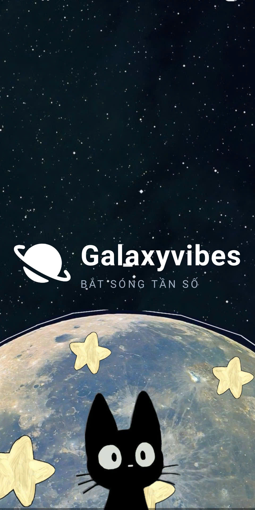
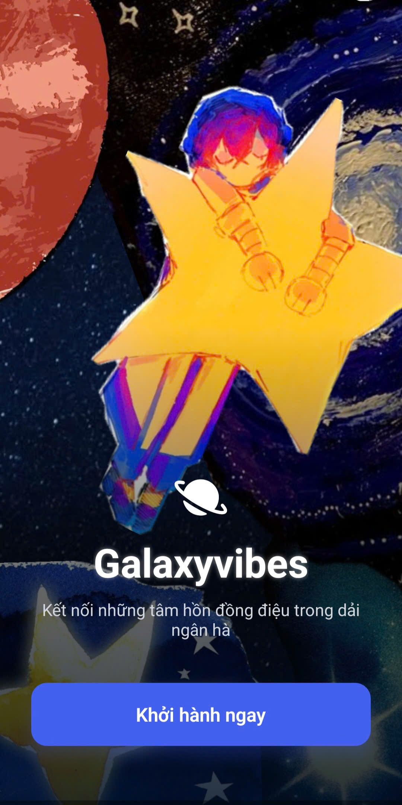
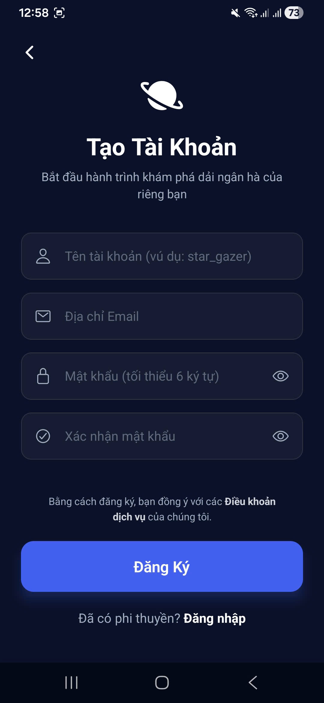
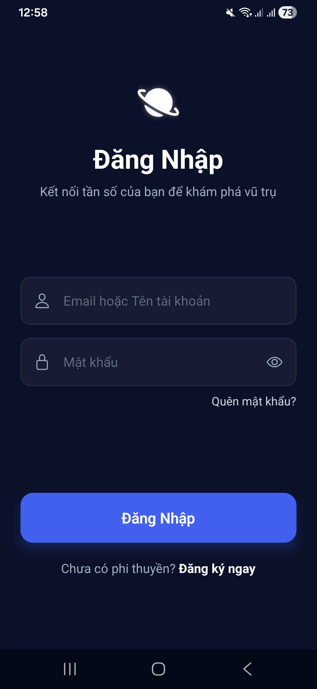
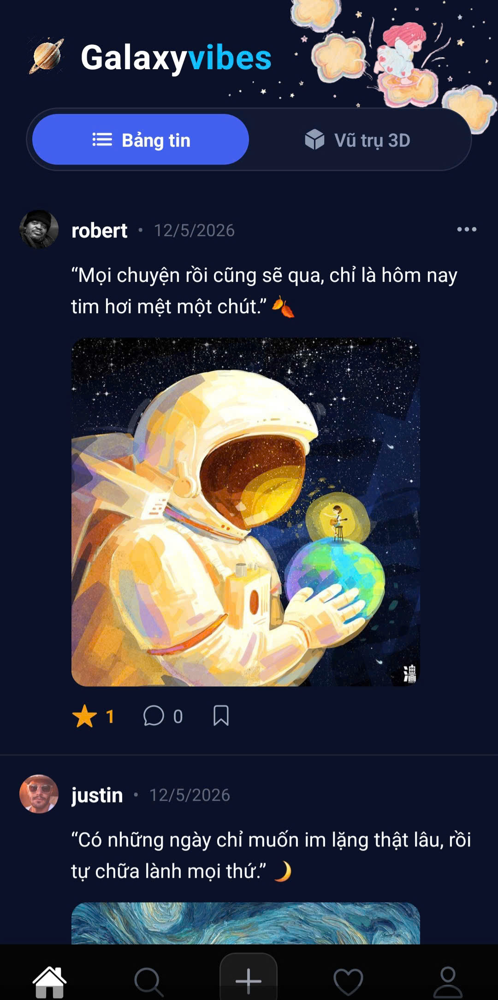
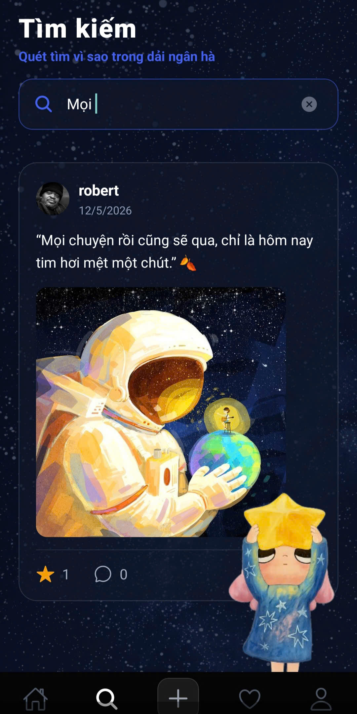
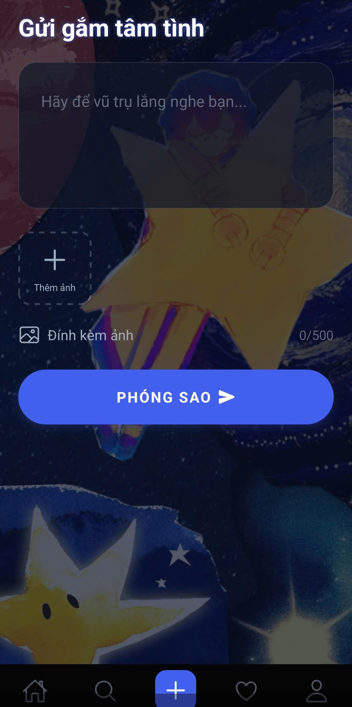
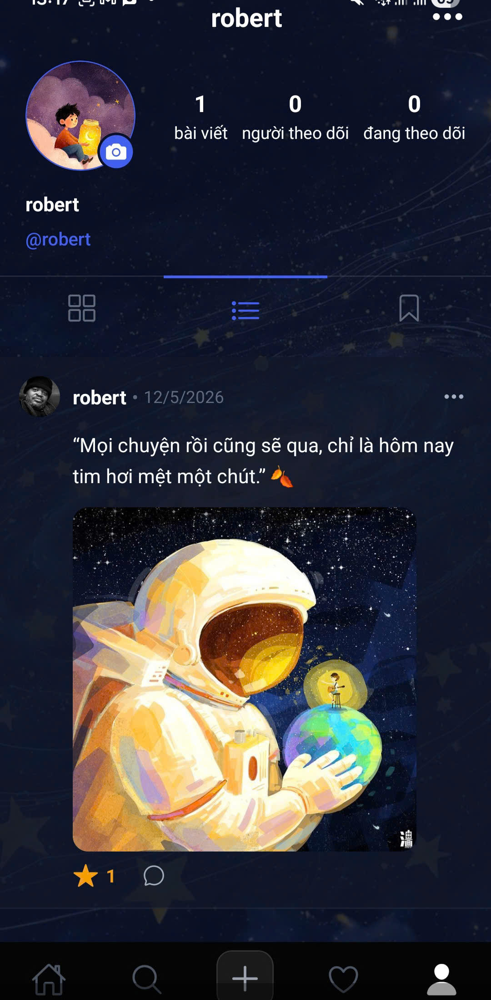
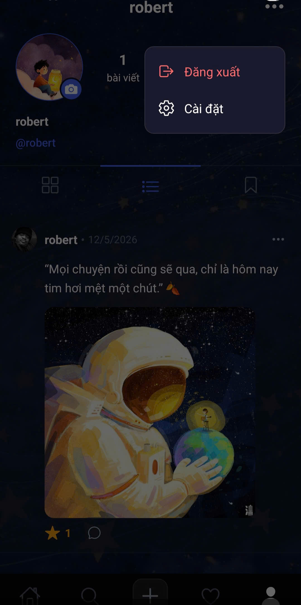
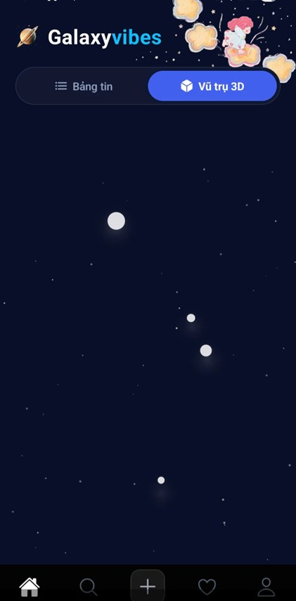

#  Galaxyvibes – Mạng xã hội “Bắt sóng tần số”

**Tên đề tài:** Xây dựng ứng dụng Galaxyvibes – Nền tảng kết nối những tâm hồn đồng điệu trong vũ trụ số

---

## Giới thiệu hệ thống

Galaxyvibes là một mạng xã hội sáng tạo lấy cảm hứng từ vũ trụ. Mỗi bài đăng (dòng tâm trạng, suy nghĩ) được hình dung như một **vì sao** – được phóng lên không gian, mang màu sắc và tần số riêng. Người dùng có thể:

- Viết blog ngắn (tâm trạng, “tần số”) kèm ảnh.
- Thả sao (like), bình luận và lưu bài viết yêu thích.
- Theo dõi những tâm hồn đồng điệu.
- Khám phá vũ trụ 3D với các vì sao tương tác (kéo, zoom, chạm để xem chi tiết).
- Nhận thông báo khi có người thả sao, bình luận hoặc theo dõi.
- Admin quản trị hệ thống (thống kê, kiểm duyệt bài viết, xuất báo cáo Excel).

Hệ thống bao gồm:
- **Backend API:** ASP.NET Core Web API, xác thực JWT, cơ sở dữ liệu SQLite.
- **Mobile App:** React Native (Expo) với giao diện đa nền tảng (Android/iOS).

---

## 👥 Danh sách thành viên

- **Hoàng Thị Thu Hoài** – MSSV: 23810310297
- **Vũ Trọng Hà Sơn** – MSSV: 23810310286

---

## Phân công nhiệm vụ

- **Hoàng Thị Thu Hoài** Thiết kế kiến trúc backend, xây dựng API (xác thực, CRUD bài viết, like, comment, follow, thông báo), phân quyền Admin, cấu hình database SQLite, deploy server.Giúp đỡ fix lỗi phần frontend, kiểm thử, quay video demo.
- **Vũ Trọng Hà Sơn:** Phát triển giao diện mobile (đăng nhập, đăng ký, bảng tin, tạo bài, tìm kiếm, thông báo, profile, chế độ 3D), tích hợp API, viết tài liệu. Giúp đỡ hỗ trợ fix lỗi phần backend.

---

##  Công nghệ sử dụng

### Backend
- ASP.NET Core 8 Web API
- Entity Framework Core (Code First) + SQLite
- JWT (JSON Web Token) – xác thực và phân quyền (Admin/User)
- Swagger (tài liệu API)
- ClosedXML (xuất file Excel)

### Frontend (Mobile App)
- React Native (Expo managed workflow)
- TypeScript
- Expo Router (file‑based routing)
- Axios (HTTP client)
- React Native Reanimated & Gesture Handler (tương tác 3D)
- AsyncStorage (lưu token)
- Expo Image Picker (chọn ảnh)

### Triển khai
- Backend: Render (Web Service) hoặc chạy local
- Database: SQLite (file `galaxyvibes.db`)

---

##  Hướng dẫn cài đặt

### Yêu cầu hệ thống
- [.NET 8 SDK](https://dotnet.microsoft.com/en-us/download)
- [Node.js](https://nodejs.org) (phiên bản LTS)
- [Expo CLI](https://docs.expo.dev/get-started/installation/) hoặc dùng `npx expo start`
- Git

### 1. Backend (ASP.NET Core + SQLite)

```bash
# Clone repository
git clone <url-repo-của-bạn>
cd galaxyvibes_mobile/Backend/Galaxyvibes.API

# Khôi phục các package NuGet
dotnet restore

# Tạo database (nếu chưa có migration)
dotnet ef migrations add InitialCreate
dotnet ef database update

# Chạy server
dotnet run

```

### 2. Frontend (React Native Expo)
```bash
# Di chuyển vào thư mục mobile
cd galaxyvibes_mobile

# Cài đặt các gói phụ thuộc
npm install

# Cấu hình URL API
# (Mặc định: http://localhost:5117/api)

# Chạy ứng dụng
npx expo start

#Quét mã QR bằng Expo Go để mở app

```

## Hướng dẫn chạy project nhanh (đã deploy sẵn)
```bash
- Nếu không muốn cài đặt local, bạn có thể sử dụng bản đã deploy:

- Backend API: https://galaxyvibes-api.onrender.com

- Mobile App: Tải file APK: https://expo.dev/artifacts/eas/qEsCS4qAuFqfjAUcY5EfV5.apk hoặc quét mã Expo Go từ link dự án của nhóm.

- Vì Server dùng Render free tier nên có thể mất 30–60 giây để khởi động nếu lâu không có truy cập.

```

## Hình ảnh chạy ứng dụng

### Màn hình splash:


### Màn hình onboarding:


### Màn hình đăng ký:


### Màn hình đăng nhập:


### Màn hình trang chủ:


### Màn hình tìm kiếm:


### Màn hình thêm bài viết:


### Màn hình thông báo:


### Màn hình trang cá nhân:


### Màn hình chọn đăng xuất:


### Màn hình chọn xóa bài viết:


### Màn hình không gian 3D:

### Link video demo: https://drive.google.com/drive/folders/1B-onWVqTnmCkVNzn7PPx5G3s7bSjpOWW?usp=sharing


- Backend API (Render): https://galaxyvibes-api.onrender.com
- Swagger UI: https://galaxyvibes-api.onrender.com/swagger
- Nếu không truy cập được, có thể server đang khởi động lại (cold start). Vui lòng chờ vài giây và thử lại.

### Link thiết kế figma: https://www.figma.com/design/24QYsDmWfvLFdSKs9U7VsN/Sans-titre?node-id=0-1&t=5TtVFt57FgjmWaOv-1


